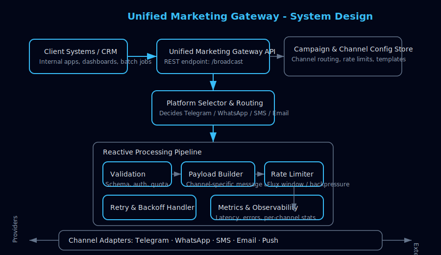

<h1 align="center">🚀 Unified Marketing Gateway</h1>

A reactive, extensible backend platform for multi-channel ad broadcasting.

## 📌 Overview

Unified Marketing Gateway is a backend system that enables businesses to broadcast marketing messages across multiple communication platforms (Telegram, WhatsApp, SMS, Email, etc.) through a single unified API.

The system is designed with reactive, scalable, rate-limited, and fault-tolerant pipelines, allowing safe and controlled fan-out of outbound marketing requests.

The project is currently in progress.
Phase 1 implements the Telegram broadcast flow using Spring WebFlux.

## 🎯 Current Features (Phase 1 — Telegram Integration)
✔ Reactive Pipeline for Outbound Requests

Built using Spring WebFlux with fully non-blocking flows.

✔ Async, High-Throughput Execution

Uses Flux pipelines to process multiple requests concurrently without thread starvation.

✔ Rate-Limited Execution

Custom reactive rate-limiter ensures controlled outbound API calls, preventing provider throttling.

✔ Automatic Retries with Exponential Backoff

Handles transient failures (timeouts, 5xx responses) with a reactive retry strategy and backoff logic.

✔ Structured Flow

Request execution pipeline includes:

Validation layer

Payload builder

Rate-limiter

Async WebClient executor

Retry & fallback handling

✔ Clean, Extensible Design

The system is structured to easily add integrations for:

WhatsApp

SMS gateways

Email services

Push notification platforms

## 🛠 Tech Stack
Component	Technology
Language	Java 17
Framework	Spring Boot (WebFlux)
Concurrency	Project Reactor (Flux/Mono)
HTTP Client	WebClient
Build Tool	Maven/Gradle
Deployment	(Planned) Docker + Kubernetes
Future Plans	Redis rate-limiter, Kafka event ingestion

## 🧱 System Design



## 🚧 Roadmap
🔹 Phase 2 (Upcoming)

WhatsApp integration

SMS provider integration

Unified error/response model

Platform-level rate limits

🔹 Phase 3

Kafka ingestion for bulk event-driven campaigns

Dashboard APIs

Per-tenant rate limits

Dynamic workflow configuration

🔹 Phase 4

End-to-end multi-channel campaign automation

Analytics & delivery metrics

Rule-engine for intelligent routing

## 🚀 Getting Started

### 🛠️ Prerequisites
- **JDK 17**: Ensure you have Java Development Kit 17 installed.
- **Maven 3.9.x**: Install Apache Maven version 3.9.x. Verify with `mvn -v`.

---

### 📦 Setup Instructions

1. **Clone the Repository**
   ```bash
   git clone https://github.com/rSparsh/Unified-Marketing-Gateway
   cd Unified-Marketing-Gateway
   ```

2. **Create Secrets File**  
   Follow the steps mentioned in the application-secrets.example.yaml file to create your own secrets file.
   Edit `application-secrets.yaml` to include your configuration (e.g., API keys, database credentials).


3. **Build the Project**  
   Run the Maven build to compile and package the application:
   ```bash
   mvn clean install
   ```

4. **Run the Application**  
   Execute the main class `UnifiedMarketingGatewayApplication` using your IDE or via the command line:
   ```bash
   mvn spring-boot:run
   ```
   *(If using an IDE, locate the `UnifiedMarketingGatewayApplication` class and run it as a Java application.)*

5. **Test with Postman**
    - Import the sample curl commands from `docs/sample-curl.txt` into Postman.
    - Replace placeholders in the imported requests with your real values.
    - Send the requests and validate the responses.

---

### 📌 Notes
- Ensure `application-secrets.yaml` is placed in the correct directory (e.g., `src/main/resources` if using Spring Boot).
- If encountering build issues, verify your JDK and Maven versions match the requirements.


## 🤝 Contributions

Since this is a personal development project, contributions are welcome via pull requests or suggestions through issues.

## 📬 Contact

Author: Sparsh Raj
GitHub: https://github.com/rSparsh

Email: sparshraj6a@gmail.com